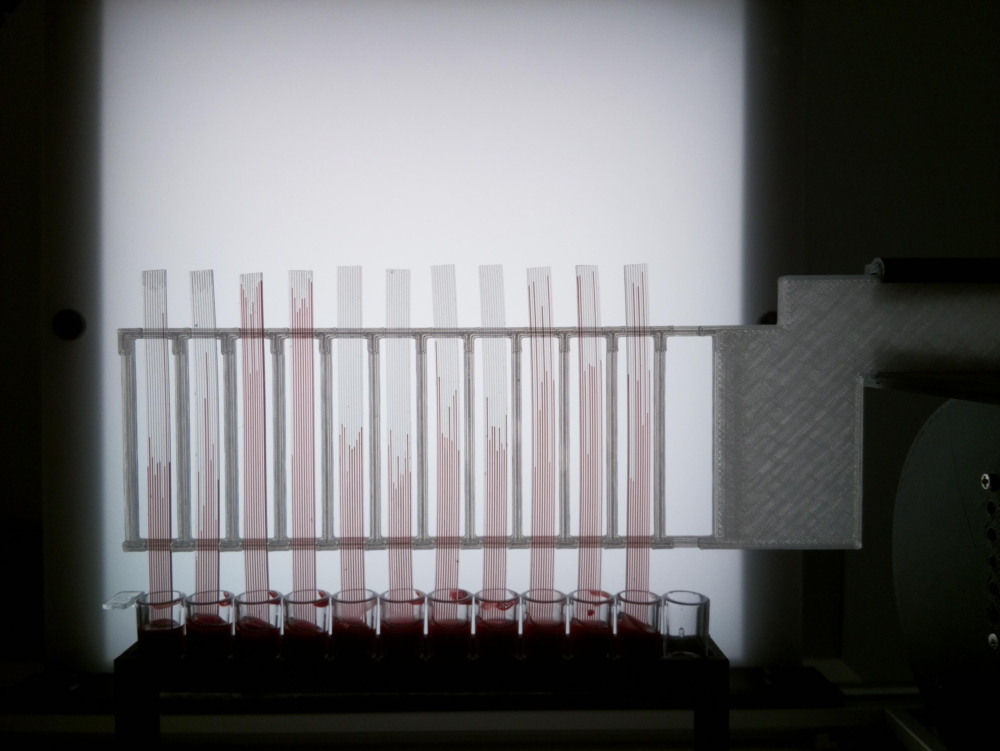

<strong>Imaging Rig</strong>

This is a device that rapid tests platelet function for epidemiology of cardiovascular health and disease.

<strong>Developed by</strong> Edwards lab, University of Reading School of Pharmacy <a href="https://research.reading.ac.uk/biomedical-technology-lab/">Biomedical Technology Lab</a>

This project aims to develop new assays and miniaturised devices to measure the function of the blood cells involved in clotting and thrombus formation- platelets (thrombocytes). The micro capillary film containing small capillaries and made using a melt extrusion process is used to develop new ways of measuring platelet function. We have been testing new detection methods such as using the Raspberry Pi camera.

This research shall contribute to the improvement of a new generation with state-of-the-art but affordable point-of-care tests for global utilizations.

The device is shown below.

The rig gives images like the following:

