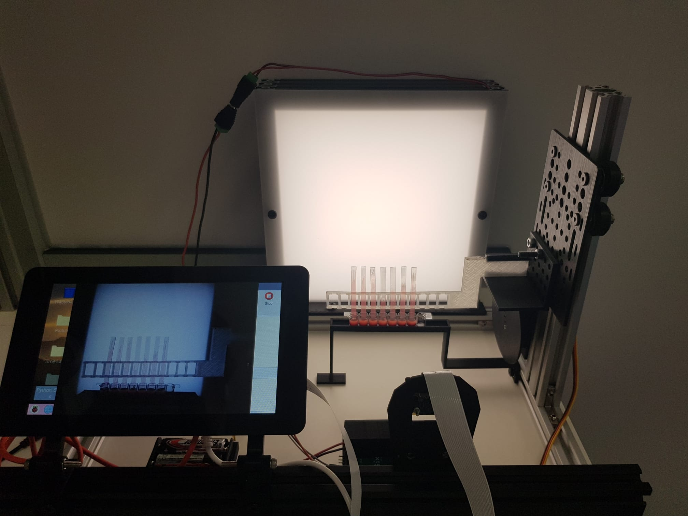
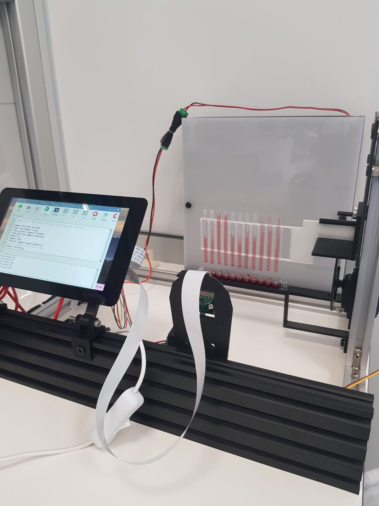
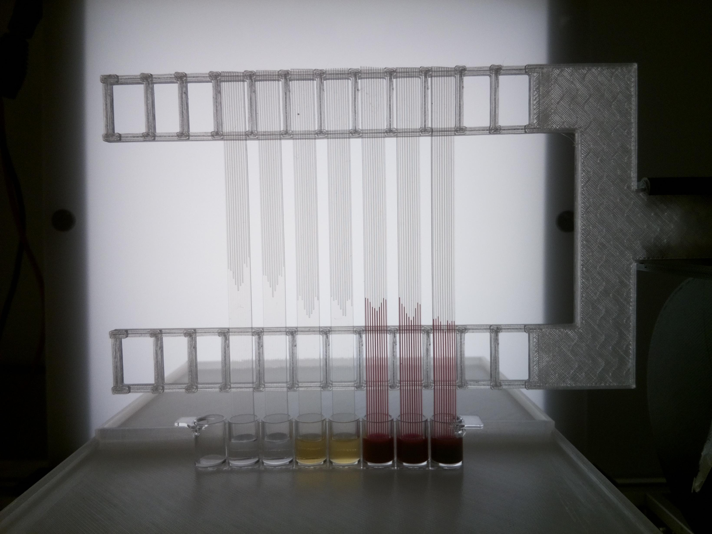

<h1 style="text-align: justify;"><strong>Imaging Rig</strong></h1>
<h2 style="text-align: center;">Lights, Camera, Action!</h2>

<strong>Developed by</strong> Edwards lab, University of Reading School of Pharmacy <a href="https://research.reading.ac.uk/biomedical-technology-lab/">Biomedical Technology Lab</a>

The imaging rig has been developing to quickly test platelet function for cardiovascular health and disease epidemiology.

This project aims to develop new assays and miniaturised devices to measure the function of the blood cells involved in clotting and thrombus formation- platelets (thrombocytes). The micro capillary film containing small capillaries and made using a melt extrusion process is used to develop new ways of measuring platelet function. We have been testing new detection methods such as using the Raspberry Pi camera.

This system can be used to measure the parameters of liquids such as density and viscosity. By taking time-lapse images, kinetic information of the fluid in the capillary can be obtained. In this way, it is a suitable device not only for blood studies, but also for anyone who wants to work with fluids.

This research shall contribute to the improvement of a new generation with state-of-the-art but affordable point-of-care tests for global utilizations.

The file with the necessary materials and prices to build the system:

<a title="Bill of Materials" href="https://gitlab.com/ruyameltem/imaging_rig/-/blob/master/Bill%20of%20Materials.pdf">Bill of Materials</a>

If you are wondering how the system works, check it out:

<a title="Rig" href="https://gitlab.com/ruyameltem/imaging_rig/-/blob/master/Rig.mp4">Rig</a>

A short video from an experiment:

<a title="Performing an experiment" href="https://gitlab.com/ruyameltem/imaging_rig/-/blob/master/Performing%20an%20experiment.mp4">Performing an experiment</a>

Here are the Python scripts you need:

<a title="Software" href="https://gitlab.com/ruyameltem/imaging_rig/-/tree/master/Software">Software</a>

Check them out for some useful links and assembly instructions:

<a title="Getting started with Raspberry Pi" href="https://www.raspberrypi.com/dhttps://www.raspberrypi.com/documentation/computers/getting-started.htmlocumentation/computers/getting-started.html" target="_blank" rel="noopener">Getting started with Raspberry Pi</a>

<a title="Documentation: Raspberry Pi" href="https://www.raspberrypi.com/documentation/" target="_blank" rel="noopener">Documentation: Raspberry Pi</a>

<a title="Software: Raspberry Pi" href="https://www.raspberrypi.com/software/" target="_blank" rel="noopener">Software: Raspberry Pi</a>

<a title="Getting started with 7&Prime; touchscreen" href="https://www.okdo.com/getting-started/get-started-with-7-touchscreen-for-raspberry-pi/" target="_blank" rel="noopener">Getting started with 7&Prime; touchscreen</a>

<a title="Getting started with picamera" href="https://projects.raspberrypi.org/en/projects/getting-started-with-picamera" target="_blank" rel="noopener">Getting started with picamera</a>

<a title="Gantry plate Assembly" href="https://ooznest.co.uk/wp-content/uploads/2018/07/OX-Assembly-Manual.pdf" target="_blank" rel="noopener">Gantry plate Assembly</a>

<a title="Instructions: servo six board" href="https://cdn.shopify.com/s/files/1/0176/3274/files/instructions_servo_six.pdf?v=1589990518" target="_blank" rel="noopener">Instructions: servo six board</a>

<a title="Relay and Raspberry Pi" href="https://www.electronicshub.org/control-a-relay-using-raspberry-pi/#:~:text=Technically%20speaking%2C%20a%20relay%20is,with%20respect%20to%20Raspberry%20Pi." target="_blank" rel="noopener">Relay and Raspberry Pi</a>

The device is shown below.

<h2 style="text-align: center;"></h2>
<h2 style="text-align: center;"></h2>

The rig gives image like the following:

